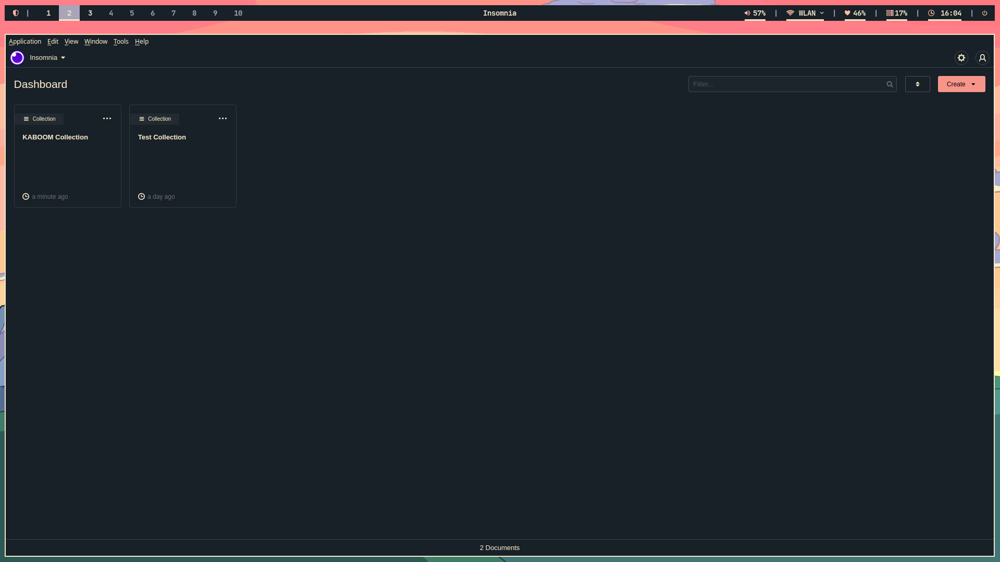
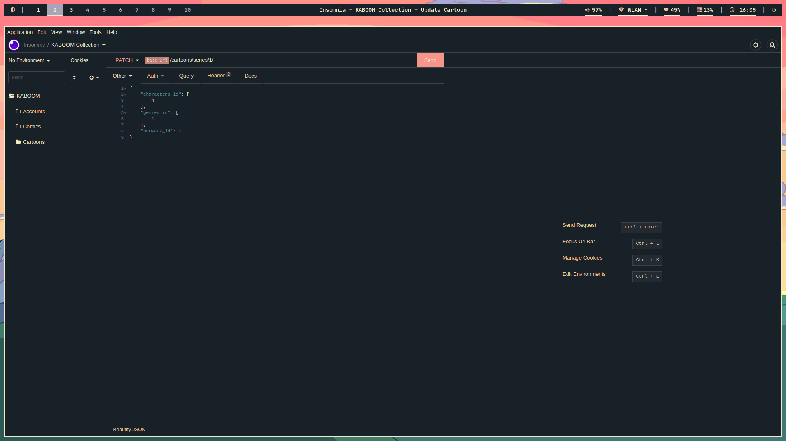

# Insomnia Wal Theme

An insomnia.rest theme to follow pywal color themes

## Caveats

Currently only tested and works with Linux. I don't have a Windows install to test on.

## Installation

1. Download or clone this repo.
2. Move the folder to `~/.config/Insomnia/plugins/`.

```
git clone https://github.com/crxssed7/insomnia-plugin-wal-theme
mv insomnia-plugin-wal-theme ~/.config/Insomnia/plugins/insomnia-plugin-wal-theme
```

3. In Insomnia - Settings -> Themes -> Wal

## Screenshots


